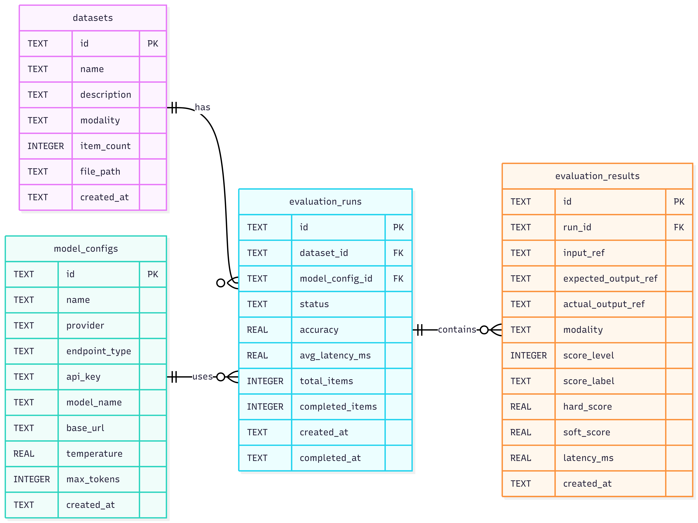
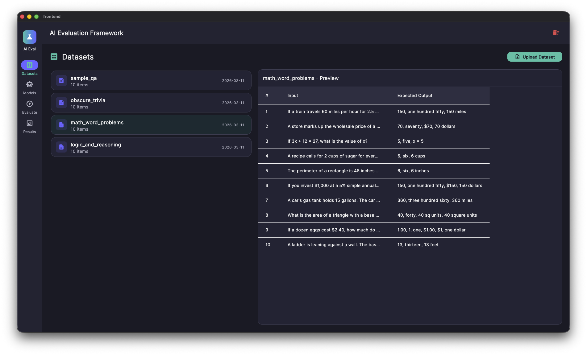
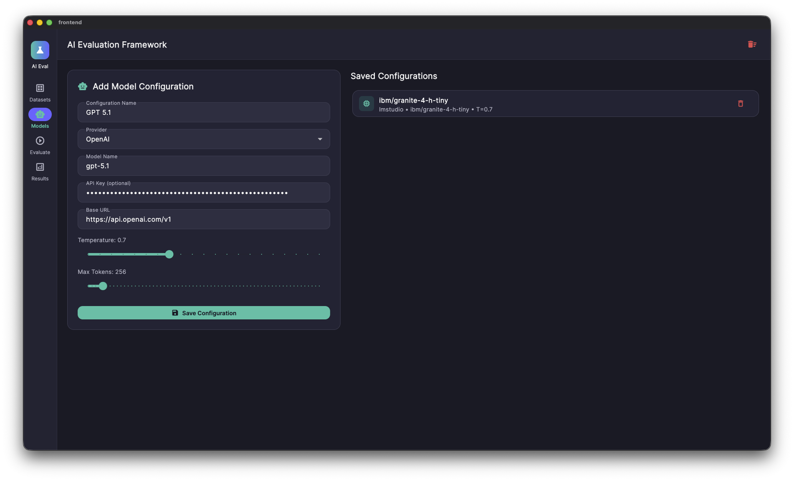
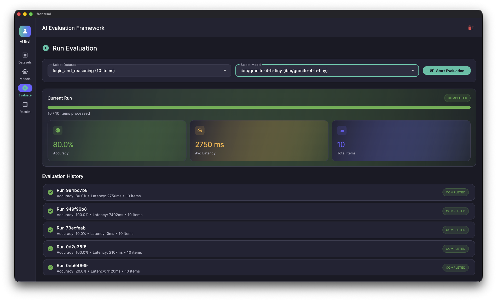
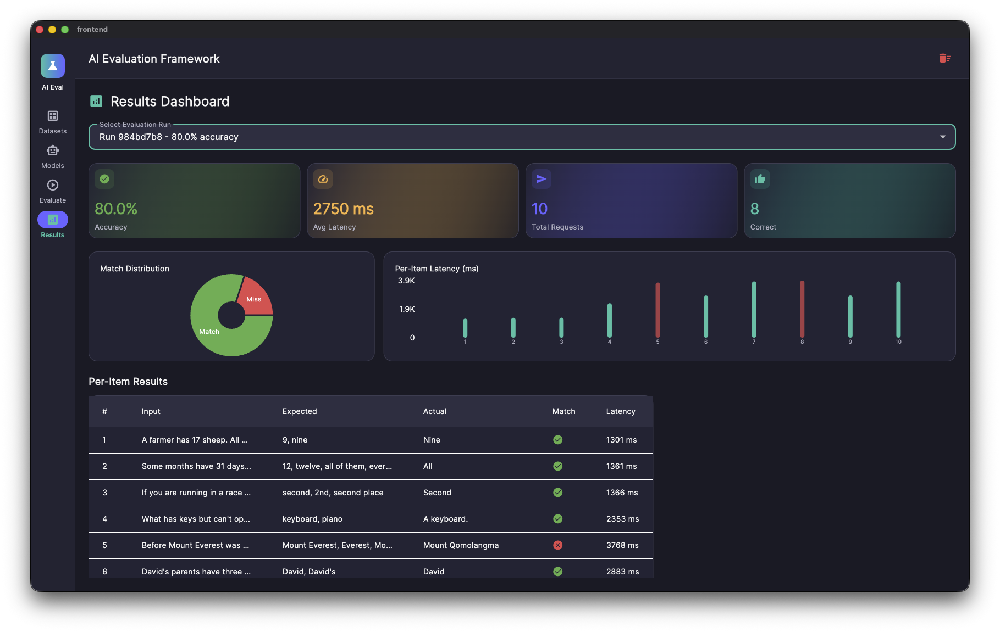

# AI Eval Framework: Multimodal & Agentic API Evaluation

A high-performance, research-driven framework for benchmarking **Multimodal AI** (Text, Image, Audio) and **Agentic Workflows**. Developed as part of a **GSoC 2026** research initiative with **API Dash**, this framework bridges the gap between traditional API testing and modern AI evaluation.

## 🖼️ Visual Overview

### System Architecture


### Dashboard Experience
| Dataset Management | Model Configuration |
| :--- | :--- |
|  |  |

| Evaluation Runner | Analysis Dashboard |
| :--- | :--- |
|  |  |

## 🚀 Research Foundation

This project is grounded in a deep literature review of seven recent peer-reviewed papers and Stanford’s **CME295** LLM Evaluation curriculum. Key architectural influences include:

- **MUSE (Multimodal Unified Safety Evaluation):** Implemented a run-centric architecture and a **Five-Level Quality Taxonomy** (Full, Partial, Indirect, Mismatch, Non-Responsive) to move beyond binary exact-match metrics.
- **Agent Credit Assignment:** Features an **Agent Trace Viewer** designed to solve long-horizon credit assignment by pinpointing exact failure steps in multi-turn tool-calling loops (Think → Call → Observe).
- **Dual-Metric Framework:** Calculates **Hard Scores** (Level 5 matches) and **Soft Scores** (Level 4+5) to provide a nuanced "Gray Zone Width" analysis of model fidelity.

## 📌 Core Features

- **Multimodal Evaluation Engine:** Native support for evaluating Image Generation (CLIP, FID) and Audio Transcription (WER, CER) as first-class citizens.
- **Hybrid Orchestration:** A Python-based backend that wraps industry standards like `lm-evaluation-harness` and `lighteval` while offering a custom engine for non-text artifacts.
- **Real-time SSE Streaming:** Monitor evaluation progress, cost, and latency in real-time at 60FPS via Server-Sent Events (SSE).
- **Agentic Trace Logic:** lightweight `/trace` endpoint for external agents (LangGraph, AutoGen) to emit step-by-step logs for granular analysis.
- **Zero-Config Persistence:** Asynchronous tracking into a local SQLite database, ensuring all data stays on-host and private.

## 🏗️ Technical Stack

- **Frontend:** Native Flutter Dashboard with Riverpod state management and `fl_chart` visualization.
- **Backend:** FastAPI Async Server with a `UniversalConnector` for OpenAI, Ollama, LM Studio, and Anthropic endpoints.
- **Database:** SQLite with `aiosqlite` and `SQLAlchemy` ORM.
- **Deployment:** Docker & Docker Compose for one-click environment setup.

## 🛠️ Getting Started

### Prerequisites
- Docker & Docker Compose
- **Alternatively:** Python 3.11+, Flutter 3.27+

### Deployment

**1. Start the Backend Infrastructure:**
```bash
docker compose up -d --build
```

**2. Run the Native Desktop Client:**
```bash
cd frontend
flutter run -d windows # or macos/linux
```

## 📚 Acknowledgments
Special thanks to the **API Dash** community and mentors for the guidance during the GSoC 2026 proposal phase. While the organization-level project changes shifted the GSoC roadmap, this framework stands as a complete, standalone realization of the proposed vision for next-generation AI testing.
